# AlgoArena

A self-hosted, distributed code execution and contest platform built for institutions that need full control over their competitive programming infrastructure.

AlgoArena runs entirely within a local or private network, eliminating dependency on third-party cloud judges — keeping your data, test cases, and student submissions fully on-premise.

---

## Team

| Name | Roll Number |
|---|---|
| Aadharsh Venkat | 241CS101 |
| Anirudh Nayak | 241CS109 |
| Pradyun Diwakar | 241CS141 |
| Aryan Sanjay Palimkar | 241CS112 |

**Team 5 — CS254 Project**  
Department of Computer Science and Engineering  
National Institute of Technology Karnataka

---

## Table of Contents

- [Overview](#overview)
- [Motivation](#motivation)
- [Exam Integrity](#exam-integrity)
- [Features](#features)
- [Architecture](#architecture)
- [Tech Stack](#tech-stack)
- [Database Schema](#database-schema)
- [Role-Based Access Control](#role-based-access-control)
- [Screenshots](#screenshots)
- [Getting Started](#getting-started)
- [Security](#security)

---

## Overview

AlgoArena provides an end-to-end environment for running timed coding contests, lab assessments, and practice sessions. Submitted code is routed through an asynchronous pipeline, evaluated against hidden test cases, and verdicts are pushed directly to the client interface in real time.

The platform supports role-based access for administrators, problem setters, and participants, with a live leaderboard, integrated Monaco-based code editor, and post-contest editorial publishing.

---

## Motivation

Cloud-hosted judges like Codeforces, LeetCode, and HackerRank are not suitable for on-premise institutional use:

- Their IP ranges span multiple CDNs and change without notice, making campus network whitelisting unreliable.
- Problem data, test cases, and student submissions reside on third-party servers with no institutional audit trail.
- They require an active internet connection — an ISP outage during an exam disrupts the entire contest.
- Grading workflows are either manual or locked behind per-seat licensing.

AlgoArena addresses each of these by running entirely within the institution's network, with full data ownership.

---

## Exam Integrity

AlgoArena's anti-cheating mechanism is network-level isolation rather than client-side restrictions, which are trivially bypassable.

Since the platform is served over localhost and accessed only within the institution's LAN, the contest administrator controls the network boundary itself:

- Participants must be physically present on the campus network to access the platform at all.
- The network administrator can block external domains at the router/firewall level for the duration of the contest — cutting off access to ChatGPT, GitHub Copilot, solution sites, or any other resource.
- Unlike browser-lockdown tools, this cannot be circumvented at the application layer — access control happens at the infrastructure level.

This mirrors how institutions already manage lab exams, making AlgoArena a natural fit for proctored assessments without requiring any additional software on participant machines.

---

## Features

| Feature | Description |
|---|---|
| Integrated Code Editor | Monaco Editor with syntax highlighting and multi-language support |
| Verdict Updates | Real-time statuses: Queued, Running, Accepted, Wrong Answer, TLE, MLE, Runtime Error, Compilation Error |
| Live Leaderboard | Rankings updated dynamically throughout active contests |
| Contest Management | Create, schedule, edit, and delete contests with configurable visibility |
| Problem Authoring | Add problems with difficulty ratings, time/memory limits, and hidden test cases |
| Post-Contest Editorials | Authors can publish solution write-ups after contest end |
| Role-Based Access Control | Separate permission scopes for Admin, Setter, and User roles |
| Multi-Language Support | Native execution pipeline for C++, Python, and more |

---

## Architecture

```
Client (React + Monaco Editor)
        |
        | HTTP
        v
  Django REST API
        |
        |---> MySQL / TiDB  (primary data store)
        |
        \---> Judge0 CE (isolated VM)
                    |
                    v
         Verdict & Metric Generation
```

The submission pipeline is fully asynchronous. Once a user submits code, it is dispatched to a Judge0 instance running on an isolated VM, executed against all test cases, and the per-testcase verdicts and aggregate result are written back and pushed to the client.

---

## Tech Stack

| Layer | Technology |
|---|---|
| Frontend | React, Vite, Framer Motion, Monaco Editor |
| Styling | Vanilla CSS (native dark/light mode) |
| Backend | Django (Python) |
| Database | MySQL / TiDB |
| Code Execution | Judge0 CE (self-hosted) |

---

## Database Schema

The relational schema is organized around the following core tables:

| Table | Purpose |
|---|---|
| `user` | Authentication, role assignment, and account status |
| `roles` | Admin, Setter, and User capability definitions |
| `profile` | Extended user metadata (college, problems solved, etc.) |
| `problems` | Problem definitions with difficulty, resource limits, and visibility |
| `tags` / `problem_tags` | Tagging for sorting and grouping problems |
| `testcases` | Per-problem input/output pairs, with visible sample flags |
| `editorials` | Post-contest markdown solutions linked to problems |
| `languages` | Catalog of supported executable programming languages |
| `Submissions` | Submission records with source, execution status, and resource usage |
| `SubmissionResults` | Per-testcase execution verdicts |
| `contests` | Contest metadata with precise scheduling boundaries |
| `contest_problems` | Mapping of problems to contests with maximum score |
| `contest_participants` | Enrollment and dynamic scoring metadata |

All primary keys use UUIDs (UUIDv4), preventing sequential enumeration vulnerabilities.

---

## Role-Based Access Control

| Capability | Admin | Setter | User |
|---|---|---|---|
| Manage Contests | Yes (all) | Yes (own only) | No |
| Add / Edit Problems | Yes (all) | Yes (own contests) | No |
| Upload Test Cases | Yes (all) | Yes (own problems) | No |
| Publish Editorials | Yes (all) | Yes (own problems) | No |
| View Submissions | Yes (all) | Yes (own contests) | Own only |
| Moderate Users | Yes | No | No |
| Compete | Yes | Yes | Yes |
| View Leaderboard | Yes | Yes | Yes |

---

## Screenshots

### Landing Page
<!-- INSERT: front_page.png -->
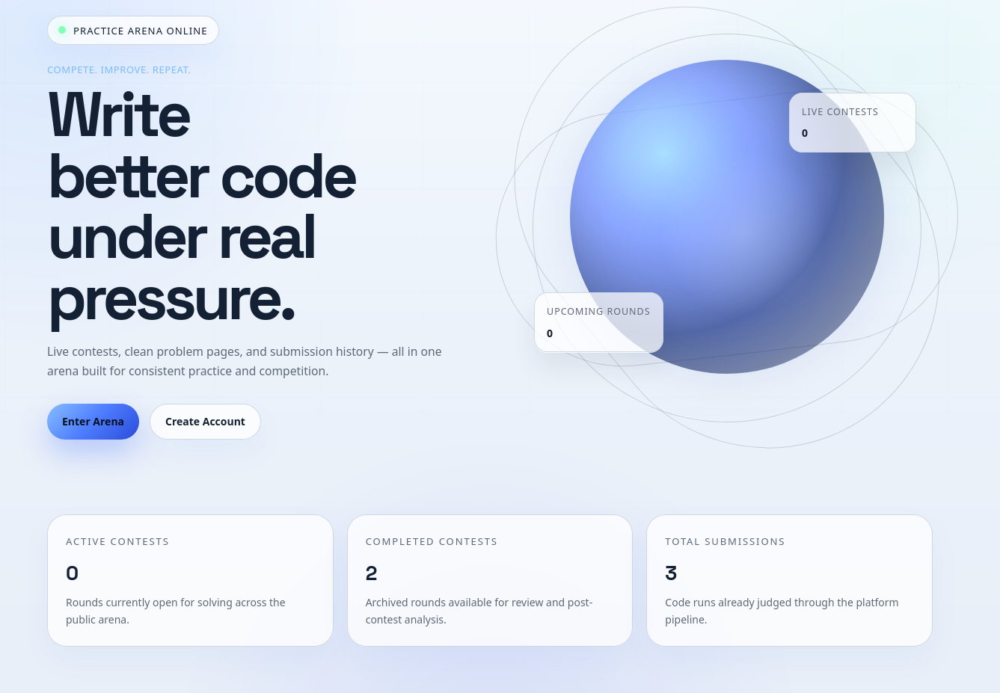

---

### Authentication

<!-- INSERT: login.png -->
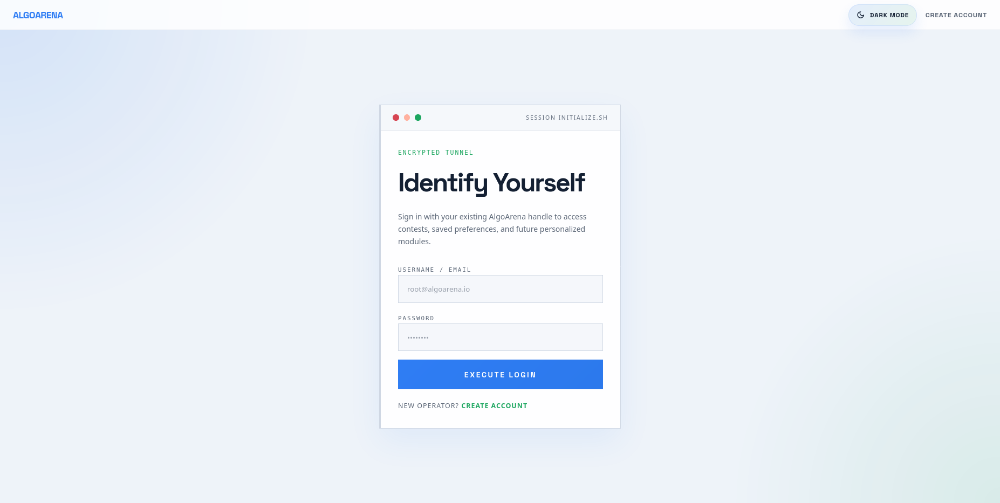

<!-- INSERT: reg.png -->
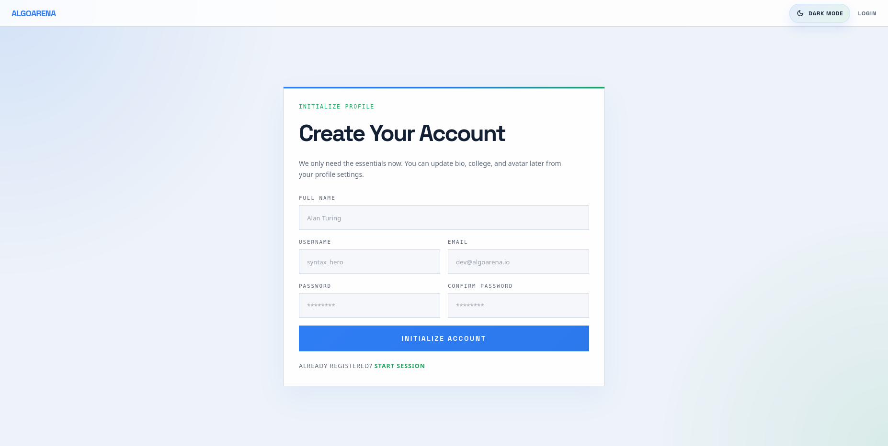

---

### User Experience

<!-- INSERT: profile.png -->
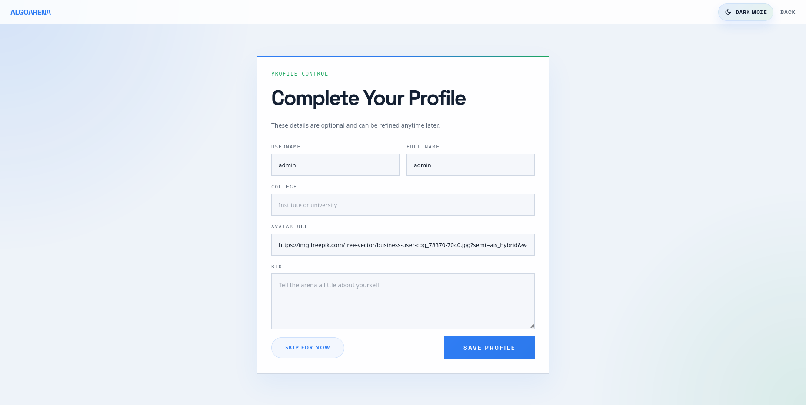

<!-- INSERT: all.png -->
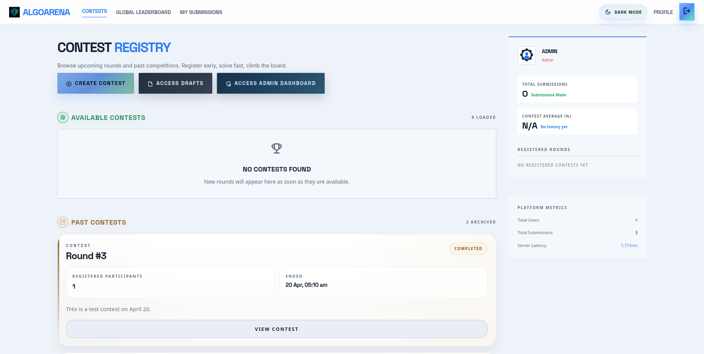

<!-- INSERT: contestinfo.png -->
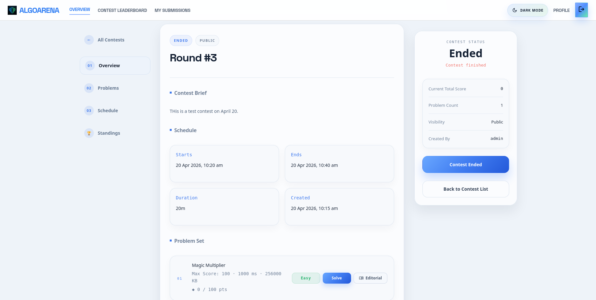

<!-- INSERT: solve.png -->
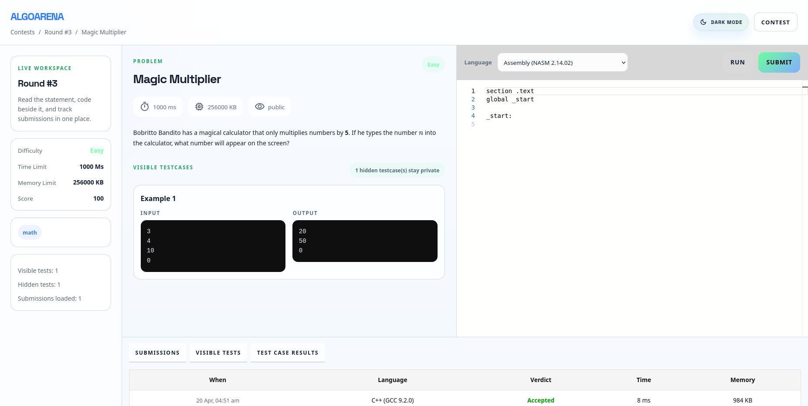

<!-- INSERT: subm.png -->
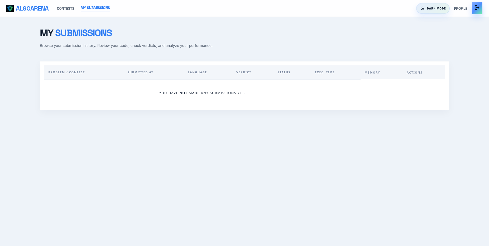

---

### Contest & Problem Management (Setter View)

<!-- INSERT: create.png -->
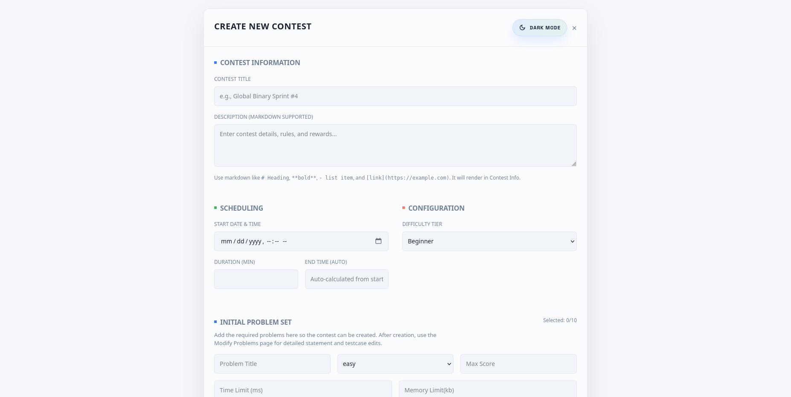

<!-- INSERT: draft.png -->
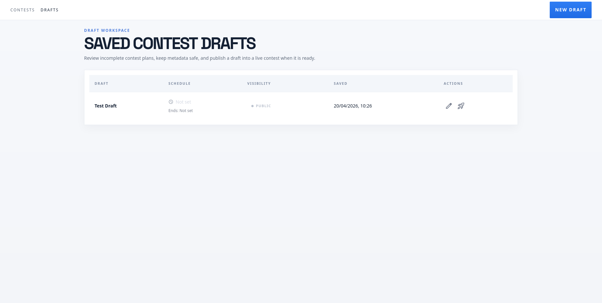

---

### Admin Panel

<!-- INSERT: dash.png -->
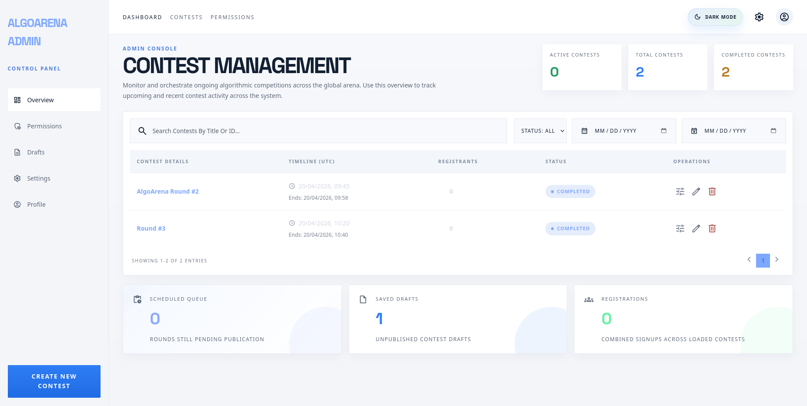

<!-- INSERT: perm.png -->
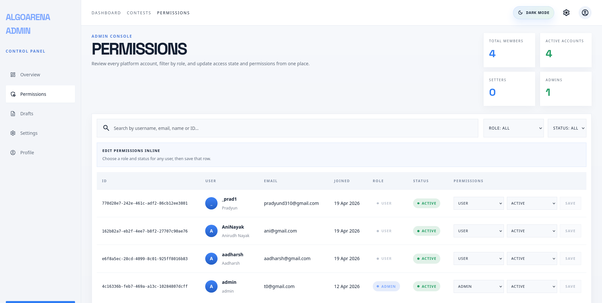

<!-- INSERT: settings.png -->
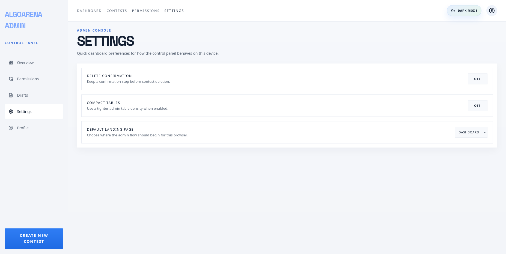

<!-- INSERT: admin_prof.png -->
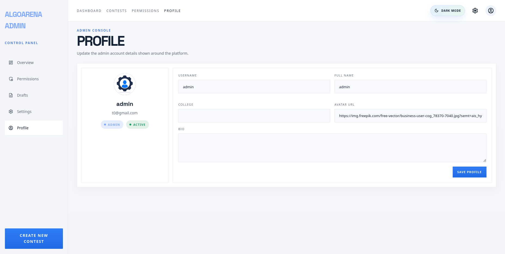

---

## Getting Started

### Prerequisites

- Node.js 18+
- Python 3.11+
- MySQL or TiDB instance
- VirtualBox (or any hypervisor) for the Judge0 VM

---

### Step 1 - Clone the Repository

```bash
git clone https://github.com/your-org/algoarena.git
cd algoarena
```

---

### Step 2 - Configure Environment Variables

```bash
cp .env.template .env
# Edit .env with your database credentials and Judge0 VM IP
```

---

### Step 3 - Set Up Judge0 (do this before running the backend)

AlgoArena uses [Judge0 CE](https://github.com/judge0/judge0) as its code execution engine. It should run on a separate VM to isolate untrusted user code from the host machine.

**Recommended VM specs (Ubuntu 22.04 LTS)**

| Resource | Minimum |
|---|---|
| RAM | 6-8 GB |
| CPU | 4 cores |
| Disk | 25-40 GB (SSD preferred) |

Inside the VM, run the following:

```bash
# 1. System update
sudo apt update && sudo apt upgrade -y
sudo apt install curl wget unzip git docker.io -y
sudo systemctl enable --now docker

# 2. Enable cgroup v1 (required by Judge0)
sudo nano /etc/default/grub
# Add to GRUB_CMDLINE_LINUX: systemd.unified_cgroup_hierarchy=0
sudo update-grub && sudo reboot

# 3. Install Docker Compose
sudo curl -L "https://github.com/docker/compose/releases/latest/download/docker-compose-$(uname -s)-$(uname -m)" \
  -o /usr/local/bin/docker-compose
sudo chmod +x /usr/local/bin/docker-compose

# 4. Download and configure Judge0
wget https://github.com/judge0/judge0/releases/download/v1.13.1/judge0-v1.13.1.zip
unzip judge0-v1.13.1.zip && cd judge0-v1.13.1
nano judge0.conf  # Set strong REDIS_PASSWORD and POSTGRES_PASSWORD

# 5. Start Judge0
docker-compose up -d db redis && sleep 10
docker-compose up -d && sleep 15
```

Verify by opening `http://<VM-IP>:2358/docs` in your browser — you should see the Swagger UI.

Find your VM's IP with `ip addr show` inside the VM, then set it in your `.env` file.

---

### Step 4 - Run the Backend

```bash
cd backend
python3 -m venv myenv
source myenv/bin/activate
pip install -r requirements.txt
python manage.py migrate
python manage.py runserver
```

---

### Step 5 - Run the Frontend

```bash
cd ../frontend
npm install
npm run dev
```

---

| Service | URL |
|---|---|
| React Frontend | `http://localhost:5173` |
| Django API | `http://localhost:8000` |
| Judge0 API | `http://<VM-IP>:2358` |

---

## Security

- Role validations are enforced natively across all API endpoints using Django's permission framework.
- Problem setter actions verify resource ownership by matching the authenticated user's ID against the problem's author field before allowing any mutation.
- All resource endpoints use UUIDv4 identifiers, preventing direct object reference and sequential enumeration attacks.
- Untrusted submission code runs inside an isolated Judge0 VM, sandboxed away from the host machine and application servers.

---
